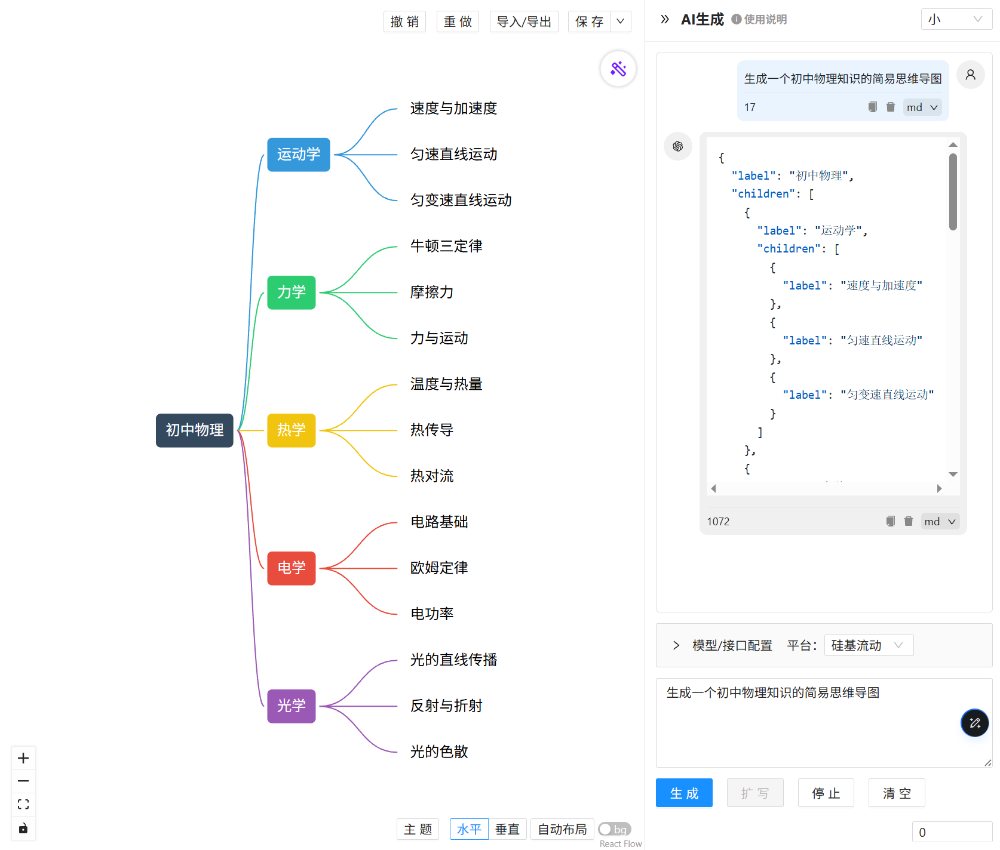

# 思维导图编辑器

一个功能强大、基于React的思维导图编辑器，支持AI辅助生成和扩写思维导图内容。

## 📋 项目概述

本项目是一款现代化的思维导图工具，结合了可视化编辑和人工智能辅助功能，帮助用户快速构建、组织和扩展知识体系。



## ✨ 核心功能

- 🎨 **可视化编辑**：直观的拖拽界面，支持创建、编辑、删除节点和连线
- 📐 **多种布局**：支持水平、垂直等多种思维导图布局方式
- 🎯 **丰富的样式**：支持不同的连线样式和节点样式
- 🧠 **AI辅助功能**：通过多种方式接入大语言模型，实现智能生成和扩写思维导图
  - 本地Ollama模型部署
  - 硅基流动平台API（部分模型免费）
  - 自定义本地API服务
- 💾 **历史记录**：支持操作历史记录，便于撤销和重做
- 💻 **响应式设计**：适配不同屏幕尺寸

## 🛠️ 技术栈

- **前端框架**：React 17
- **构建工具**：Modern.js
- **可视化库**：@xyflow/react
- **UI组件库**：Ant Design
- **状态管理**：@modern-js/runtime
- **样式处理**：Less、Styled Components
- **AI集成**：Ollama API、硅基流动API

## 🚀 快速开始

### 前置条件

1. [Node.js LTS](https://github.com/nodejs/Release) 环境
2. 推荐使用 [nvm](https://github.com/nvm-sh/nvm) 管理Node.js版本
3. 如需使用AI功能，请参考[AI功能配置](#ai-功能配置)部分

### 安装依赖

```bash
# 使用npm
npm install

# 或使用yarn
yarn install
```

### 开发模式

```bash
yarn dev
```

启动后，打开浏览器访问 [http://localhost:8080](http://localhost:8080) 查看项目。

### 构建项目

```bash
yarn build
```

构建完成后，生成的静态文件位于 `dist` 目录。

### 生产环境运行

```bash
yarn start
```

## 📝 使用指南

### 基础操作

- **创建节点**：点击现有节点，通过上下文菜单添加子节点
- **编辑节点**：双击节点可编辑文本内容
- **删除节点**：选中节点后按Delete键或通过上下文菜单删除
- **调整布局**：通过右侧面板选择不同的布局方式
- **修改连线样式**：通过右侧面板选择不同的连线样式

### AI功能配置

项目支持三种AI接入方式：

#### 1. 本地Ollama部署

1. 安装Ollama：[https://ollama.com](https://ollama.com)
2. 拉取并启动模型，例如：
   ```bash
   ollama pull deepseek-r1:1.5b
   ollama run deepseek-r1:1.5b
   ```
3. 设置环境变量以允许跨域请求：
   ```bash
   # Windows
   set OLLAMA_ORIGINS=*
   
   # macOS/Linux
export OLLAMA_ORIGINS=*
   ```
4. 启动Ollama服务：
   ```bash
   yarn server
   ```

#### 2. 硅基流动平台

1. 访问[硅基流动官网](https://siliconflow.cn)注册账号
2. 进入【API密钥】菜单创建一个API密钥
3. 在应用中配置API密钥和模型信息

#### 3. 自定义本地API

开发者可以实现自定义的本地API服务，并在应用中配置相应的接口信息。

## 🎯 应用场景

- 📚 **知识整理**：将零散的知识点系统化整理
- 📝 **头脑风暴**：快速记录和组织创意想法
- 📊 **项目规划**：梳理项目结构和任务关系
- 📖 **学习笔记**：将学习内容以可视化方式呈现

## 🔧 开发指南

### 添加新功能

```bash
yarn new
```

通过Modern.js的交互式命令行工具添加新的应用入口、组件等。

### 代码检查

```bash
yarn lint
```

## 📄 许可证

MIT

## 🤝 贡献指南

欢迎提交Issue和Pull Request来改进这个项目！
